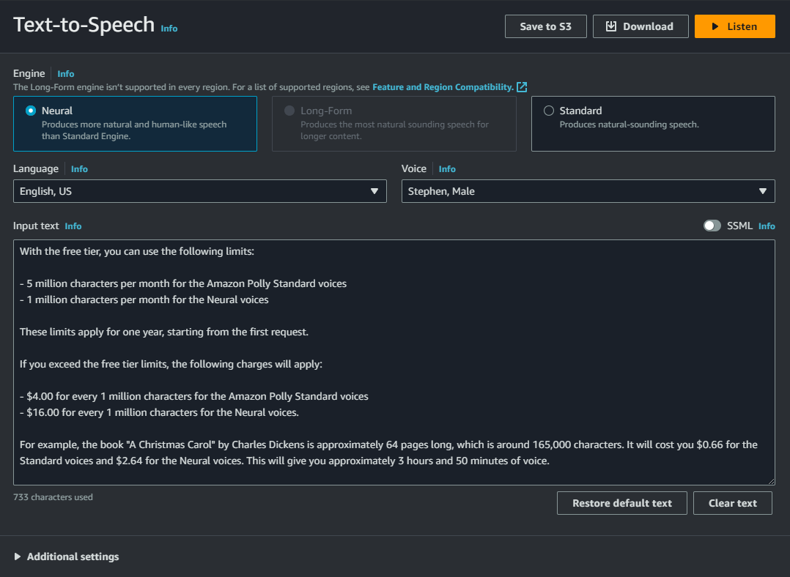
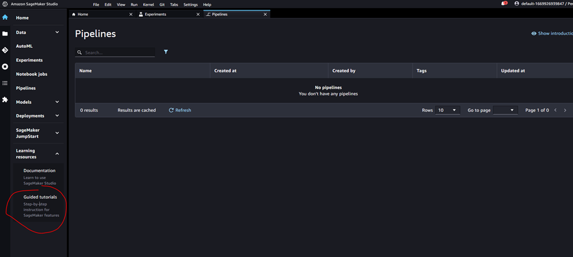

[](https://classroom.github.com/a/ntg-lIM7)

# Cloud for AI

## Assignment 1 - Docker

In this exercise, you will create 2 Docker containers. The first one will train your AI model. The second one will host
an application using your model. You can use an existing training model from the internet (document the source of your
example) or you can use a model that you created yourself in another course.

Use a Git repository in which you commit your code and add a Readme file that gives some information on how to use your
code.
Deadline for this assignment is 6 December 2021

---

**Note** that you can detach the terminal from the container by adding the `-d` flag to the `docker-compose up` command.

You can train and run the model using the following command:

```shell
docker-compose up
```

When you want to retrain the model, you can use the following command:

```shell
docker-compose up --build train
```

When you want to run the application, you can use the following command:

```shell
docker-compose up --build server
```

You can test the server using the following command: _make sure the server is running_

```shell
python test.py
```

## Assignment 2 - SageMaker

### Part 1: Managed AI services in AWS

Choose one of the following services:

| Amazon Comprehend  | NLP                         |
|--------------------|-----------------------------|
| Amazon Polly       | Text to Speech              |
| Amazon Rekognition | Computer vision             |
| Amazon Textract    | Extract text from documents |
| Amazon Transcribe  | Speech to text              |
| Amazon Lex         | Conversational applications |

For the service that you choose, create a presentation in which you discuss the following:

- What is the price to use this service?
- Can the service be used inside the console and how?
- Build a simple python application in which you use the service

---

### Amazon Polly

#### Price

With the free tier, you can use the following limits:

- 5 million characters per month for the Amazon Polly Standard voices
- 1 million characters per month for the Neural voices

These limits apply for one year, starting from the first request.

If you exceed the free tier limits, the following charges will apply:

- $4.00 for every 1 million characters for the Amazon Polly Standard voices
- $16.00 for every 1 million characters for the Neural voices.

For example, the book "A Christmas Carol" by Charles Dickens is approximately 64 pages long, which is around 165,000
characters. It will cost you $0.66 for the Standard voices and $2.64 for the Neural voices. This will give you
approximately 3 hours and 50 minutes of voice.

Note that when you first store it in an S3 bucket, you will need to keep in mind that this will also incur costs.

### Console

In the AWS Console, generating an mp3 TTS file is quite simple.

To do this in Amazon Polly, you can click the "Try Polly" button. Once you are in the "Text-to-Speech" tab, you just
need to enter the text, choose the desired language and voice. Then, you can listen to the audio, download it, and even
save it to S3.

Please note that if you wish to use the Neural voices, you need to be connected to one of the regions mentioned in the
following link: [NTTS Regions](https://docs.aws.amazon.com/polly/latest/dg/NTTS-main.html#ntts-regions)



Generating and downloading the file only took about 2 seconds.

[speech_20231210105110721.mp3](resources/speech_20231210105110721.mp3)

### Python Script

The provided Python script is used for text-to-speech conversion using Amazon Polly. The script takes input either from
a file or as text and generates an output file in the specified format (default is `mp3`). The script utilizes the Boto3
library to interact with Amazon Polly and synthesize speech.

```python
#!/usr/bin/env python3

import argparse

import boto3

parser = argparse.ArgumentParser(description='Text to Speech')
parser.add_argument('output', help='Output file name', type=str)

group = parser.add_mutually_exclusive_group(required=True)
group.add_argument('-f', '--file', help='File to be converted to speech', type=str)
group.add_argument('-t', '--text', help='Text to be converted to speech', type=str)

args = parser.parse_args()

text = open(args.file, 'r').read() if args.file else args.text
fileformat = args.output.split('.')[-1] or 'mp3'

file = open(args.output, 'wb')

client = boto3.client('polly')

response = client.synthesize_speech(Text=text, OutputFormat=fileformat, VoiceId='Joanna')

file.write(response['AudioStream'].read())
file.close()
```

To execute the script, use one of the following commands:

```bash
./tts.py --text "This is converted by using text as input" output-text.mp3

./tts.py --file input.txt output-file.mp3
```

Text:
[output-text.mp3](resources/output-text.mp3)

File:
[output-file.mp3](resources%2Foutput-file.mp3)

---

# Part 2: Amazon Sagemaker

Use the guided tutorial “Train an ML model” to get familiar with AWS Sagemaker

[Tutorial - Train a Machine Learning Model - Amazon Web Services](https://aws.amazon.com/tutorials/machine-learning-tutorial-train-a-model/)



When you finished the tutorial, create a solution for a ML model that you choose. This can be your own model that you
created in another course or you can find an existing one online.

Then you present your solution in a video:

- Explain what your solution does
- Demonstrate your solution
- Step through your code

---

In the following notebook, we utilize the MNIST database of handwritten digits to construct a $k$-Nearest Neighbors
MultiClass Classification model. We create two models: one using the $28 \times 28$ pixel images, and another using an
autoencoder.

Some logs have been removed for readability.

[train-simplified.ipynb](resources/train-simplified.ipynb)
or the converted HTML version:
[train-simplified.html](resources/train-simplified.html)